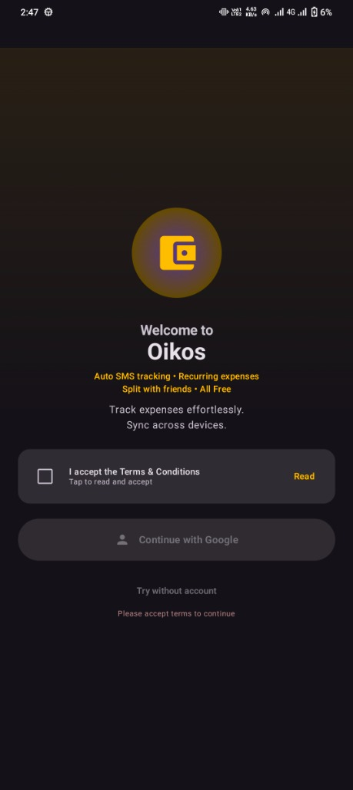
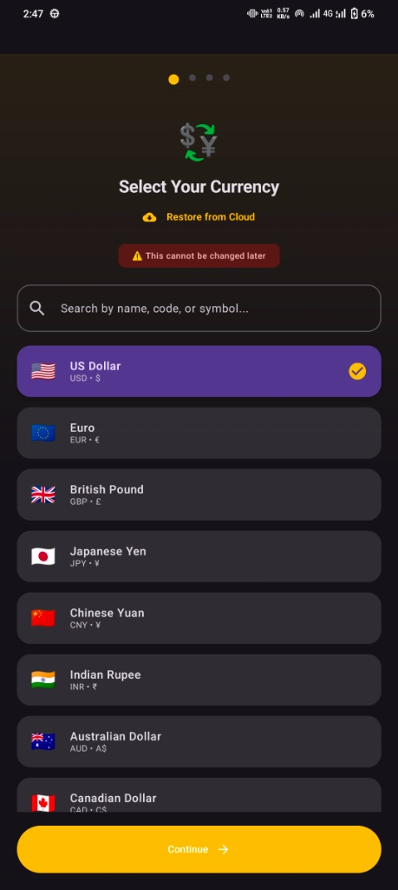
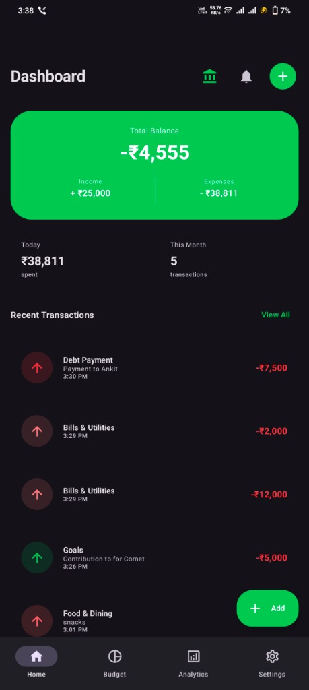
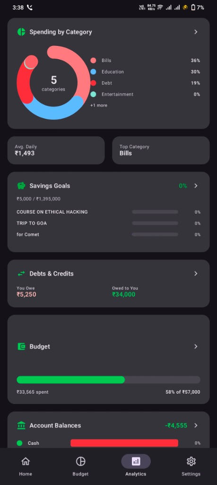
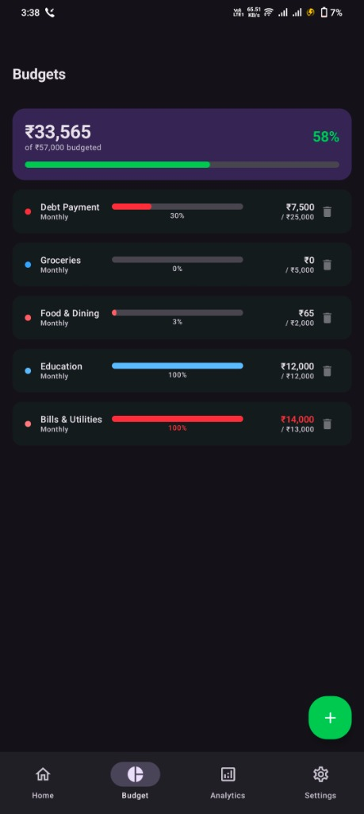
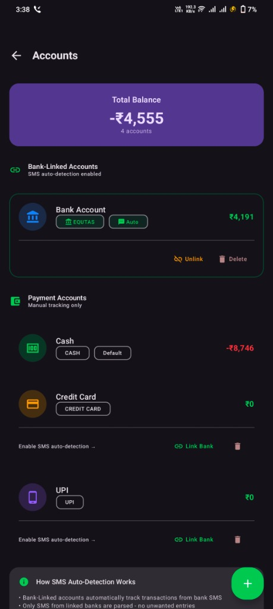
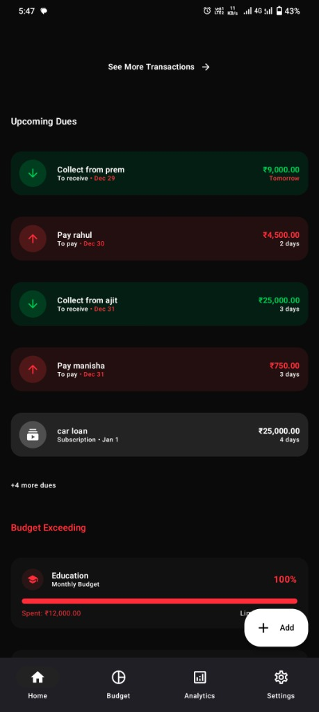
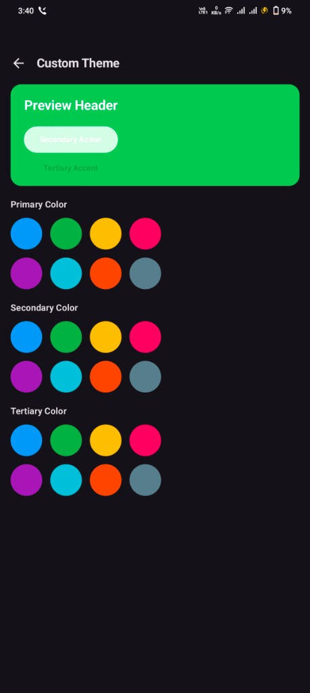

<p align="center">
  
</p>

<h1 align="center">EP Manager</h1>

<p align="center">
  <strong>Smart Expense Manager with AI-Powered Insights</strong>
</p>

<p align="center">
  <a href="#features">Features</a> •
  <a href="#screenshots">Screenshots</a> •
  <a href="#tech-stack">Tech Stack</a> •
  <a href="#getting-started">Getting Started</a> •
  <a href="#architecture">Architecture</a> •
  <a href="#license">License</a>
</p>

<p align="center">
  
  
  
  
  
  
</p>

---

## 📱 Overview

**EP Manager** is a modern, feature-rich expense management application for Android, built entirely with **Jetpack Compose** and **Material 3**. It combines intelligent SMS parsing with AI-powered insights to automatically track your expenses, helping you manage your finances effortlessly.

---

## ✨ Features

### 🔐 Smart SMS Parsing
Automatically detect and parse bank transaction SMS messages to log expenses and income without manual entry.

- **Multi-Bank Support**: Pre-configured patterns for 15+ Indian banks (HDFC, SBI, ICICI, Axis, Kotak, etc.)
- **UPI Provider Support**: Google Pay, PhonePe, Paytm, Amazon Pay
- **Account Matching**: Automatically matches transactions to your linked accounts using last 4 digits
- **AI-Powered Parsing**: Uses Firebase AI (Gemini) for complex SMS formats when regex fails
- **Custom Templates**: Learn patterns from sample SMS for unsupported banks

### 🧠 AI-Powered Features
Leverages Firebase AI (Gemini) for intelligent financial insights.

- **Smart Category Suggestions**: AI suggests transaction categories based on descriptions
- **Spending Insights**: Personalized spending analysis and recommendations
- **Spending Predictions**: Predict next month's spending based on historical data
- **Pattern Recognition**: Identifies spending patterns and anomalies

### 💰 Transaction Management
Comprehensive tracking of all your financial transactions.

- **Expense/Income Tracking**: Log both expenses and income with detailed categorization
- **Location Recording**: Automatically capture transaction location with GPS
- **Rich Metadata**: Store merchant name, reference numbers, UPI IDs, and notes
- **Transaction History**: Browse, search, and filter transactions with pagination
- **Edit & Delete**: Modify or remove transactions with full audit trail

### 📊 Analytics & Insights
Beautiful visualizations to understand your spending patterns.

- **Spending Breakdown**: Category-wise expense analysis
- **Income vs Expense**: Compare your earnings and spending
- **Trend Analysis**: Daily, weekly, monthly spending trends
- **Top Categories**: Identify where your money goes
- **Custom Date Ranges**: Analyze any time period

### 💼 Multi-Account Support
Manage all your payment methods in one place.

- **Account Types**: Cash, Bank, UPI, Credit Card, Wallet, and custom types
- **Account Linking**: Link SMS sender IDs to accounts for automatic matching
- **Balance Tracking**: Real-time balance updates based on transactions
- **Account Colors & Icons**: Customize appearance for easy identification

### 📋 Budget Management
Set and track budgets to control your spending.

- **Category Budgets**: Set limits for specific expense categories
- **Flexible Periods**: Daily, weekly, bi-weekly, monthly, quarterly, yearly
- **Alert Thresholds**: Get notified when approaching budget limits
- **Progress Tracking**: Visual progress bars and percentage indicators
- **Budget Alerts**: Smart notifications for overspending

### 🎯 Savings Goals
Set and achieve your financial goals.

- **Goal Presets**: Vacation, Car, Home, Gadget, Education, Wedding, Emergency, Gift
- **Target Dates**: Optional deadlines with on-track indicators
- **Contribution Tracking**: Log contributions from any account
- **Progress Visualization**: See how close you are to each goal
- **Custom Icons & Colors**: Personalize each goal

### 💳 Debt & Credit Management
Track money you owe or are owed.

- **Debt/Credit Types**: Track money you owe vs money owed to you
- **Person Tracking**: Associate debts with specific people
- **Payment History**: Log partial payments over time
- **Due Dates**: Set reminders for payment deadlines
- **Overdue Alerts**: Notifications for past-due debts
- **Friend Linking**: Link to friends who use the app

### 🔄 Recurring Expenses
Manage subscriptions and regular payments.

- **Multiple Frequencies**: Daily, weekly, bi-weekly, monthly, quarterly, yearly
- **Auto-Add**: Automatically create transactions on due dates
- **Reminder Notifications**: Get reminded before payments are due
- **Subscription Tracking**: Dedicated view for all subscriptions
- **Cost Summaries**: Monthly and yearly subscription cost analysis

### 👥 Expense Splitting (Splitwise-like)
Split expenses with friends and groups.

- **Create Groups**: Roommates, trips, events, etc.
- **Add Members**: Invite friends by name, phone, or email
- **Split Types**: Equal, exact amounts, percentage, or shares
- **Balance Tracking**: See who owes whom
- **Settlements**: Record payments between members
- **Sync Support**: Share splits with friends who use the app

### 🏠 Home Screen Widget
Quick access to today's financial summary.

- **Daily Summary**: Today's income, expense, and balance
- **Date Display**: Current date for reference
- **Quick Launch**: Tap to open the app
- **Auto-Update**: Refreshes automatically

### 📤 Export & Backup
Keep your data safe and accessible.

- **CSV Export**: Export transactions for spreadsheets
- **PDF Reports**: Generate formatted financial reports
- **Excel Export**: Full-featured Excel spreadsheets
- **Custom Date Ranges**: Export any time period
- **Cloud Backup**: Sync settings to Firebase
- **Transaction Backup**: Optional manual transaction backup
- **Restore on Reinstall**: Recover data on new devices

### 🔔 Smart Notifications
Stay informed about your finances.

- **Budget Alerts**: Notifications when approaching limits
- **Bill Reminders**: Upcoming recurring expense alerts
- **Goal Milestones**: Celebrate savings achievements
- **Debt Due Dates**: Reminders for payment deadlines

### 🎨 Customization
Make the app your own.

- **Theme Options**: Rose (Default), Monochrome, Dynamic (Android 12+), Custom
- **Custom Colors**: Pick your own primary, secondary, and tertiary colors
- **Dark Mode**: System, Light, or Dark mode options
- **Currency Selection**: 100+ world currencies with symbols and flags

### 🔒 Security
Keep your financial data safe.

- **Encrypted Storage**: Sensitive data stored with AES-256 encryption
- **Biometric Support**: Optional biometric authentication
- **PIN Protection**: Set a PIN for app access
- **Secure Sync**: Encrypted cloud synchronization

### ☁️ Cloud Sync (Firebase)
Keep your data synchronized across devices.

- **Google Sign-In**: Quick authentication with Google
- **Settings Sync**: Automatic sync of budgets, goals, accounts, categories
- **Split Group Sync**: Share expense splits with other users
- **Transaction Backup**: Optional manual backup of transaction history
- **Offline-First**: App works offline, syncs when connected

---

## 📸 Screenshots

<p align="center">
  
  
  
  
</p>

<p align="center">
  
  
  
  
</p>

<p align="center">
  
</p>

| Screen | Description |
|--------|-------------|
| **Welcome** | Onboarding with Google Sign-In and terms acceptance |
| **Currency** | Select from 100+ world currencies with flags |
| **Home** | Dashboard with balance, income/expense summary, and recent transactions |
| **Analytics** | Financial health score, spending trends, and insights |
| **Spending** | Category breakdown, savings goals, debts & credits overview |
| **Budgets** | Category-wise budget tracking with progress bars |
| **Accounts** | Bank-linked & payment accounts with SMS auto-detection |
| **Upcoming Dues** | Debts to collect/pay and budget alerts |
| **Theme** | Customize colors with live preview |

---

## 🎨 Color Scheme

EP Manager uses a carefully designed color palette that works beautifully in both light and dark modes.

### Primary Colors

| Color | Hex | Usage |
|-------|-----|-------|
| Rose | `#A85751` | Primary accent, brand color |
| Rose Light | `#F5E6E5` | Primary container (light) |
| Rose Dark | `#8B3D38` | Primary container (dark) |

### Secondary Colors

| Color | Hex | Usage |
|-------|-----|-------|
| Teal | `#14B8A6` | Income, positive transactions |
| Purple | `#8B5CF6` | Tertiary accent |
| Blue | `#3B82F6` | Information, links |
| Amber | `#F59E0B` | Warnings, alerts |
| Green | `#22C55E` | Success, goals |

### Semantic Colors

| Color | Hex | Usage |
|-------|-----|-------|
| Success | `#22C55E` | Positive actions, income |
| Warning | `#F59E0B` | Budget alerts, deadlines |
| Error | `#EF4444` | Errors, overspending |
| Info | `#3B82F6` | Informational messages |

### Monochrome Theme

| Color | Hex | Usage |
|-------|-----|-------|
| Black | `#000000` | Primary (light mode) |
| White | `#FFFFFF` | Primary (dark mode) |
| Gray Dark | `#222222` | Accents |
| Gray Light | `#EEEEEE` | Backgrounds |

### Category Colors

| Category | Color |
|----------|-------|
| Food | `#FF6B6B` |
| Transport | `#4ECDC4` |
| Shopping | `#FFE66D` |
| Entertainment | `#95E1D3` |
| Bills | `#F38181` |
| Healthcare | `#AA96DA` |
| Education | `#74B9FF` |
| Travel | `#FD79A8` |
| Groceries | `#55A3FF` |
| Subscriptions | `#A29BFE` |

---

## 🛠 Tech Stack

### Core
- **Language**: Kotlin 1.9+
- **UI Framework**: Jetpack Compose (Material 3)
- **Min SDK**: 26 (Android 8.0)
- **Target SDK**: 35 (Android 15)

### Architecture & DI
- **Architecture**: MVVM with Clean Architecture principles
- **Dependency Injection**: Hilt (Dagger)
- **Navigation**: Jetpack Navigation Compose

### Data & Storage
- **Local Database**: Room (SQLite)
- **Preferences**: DataStore (Preferences)
- **Secure Storage**: EncryptedSharedPreferences
- **Pagination**: Paging 3

### Firebase Services
- **Authentication**: Firebase Auth (Google Sign-In)
- **Database**: Firebase Realtime Database
- **AI**: Firebase AI (Gemini API)
- **Analytics**: Firebase Analytics
- **Crashlytics**: Firebase Crashlytics
- **Performance**: Firebase Performance

### Background Processing
- **WorkManager**: Background sync and notifications
- **Coroutines**: Asynchronous operations

### Other Libraries
- **Coil**: Image loading
- **Play Services**: Location, Credentials, In-App Review
- **LeakCanary**: Memory leak detection (debug)

---

## 📁 Project Structure

```
app/src/main/java/com/theblankstate/epmanager/
├── ai/                     # AI services (Gemini integration)
│   └── GeminiAIService.kt
├── data/
│   ├── api/               # Remote API interfaces
│   ├── export/            # Export functionality
│   ├── local/             # Room database, DAOs
│   ├── model/             # Data models/entities
│   ├── repository/        # Repository implementations
│   └── sync/              # Firebase sync managers
├── di/                    # Hilt dependency injection modules
├── navigation/            # Navigation routes and setup
├── notifications/         # Notification handling
├── security/              # Encrypted preferences
├── sms/                   # SMS parsing and handling
│   ├── AccountMatcher.kt
│   ├── AiSmsParser.kt
│   ├── SmsBroadcastReceiver.kt
│   ├── SmsParser.kt
│   └── SmsPermissionManager.kt
├── ui/
│   ├── accounts/          # Account management screens
│   ├── add/               # Add transaction screen
│   ├── ai/                # AI insights screen
│   ├── analytics/         # Analytics & charts
│   ├── auth/              # Authentication screens
│   ├── budget/            # Budget management
│   ├── categories/        # Category management
│   ├── components/        # Reusable UI components
│   ├── debt/              # Debt tracking screens
│   ├── edit/              # Edit transaction screen
│   ├── export/            # Export screen
│   ├── friends/           # Friends management
│   ├── goals/             # Savings goals
│   ├── home/              # Home dashboard
│   ├── notifications/     # Notification settings
│   ├── onboarding/        # Onboarding flow
│   ├── recurring/         # Recurring expenses
│   ├── settings/          # App settings
│   ├── sms/               # SMS templates screen
│   ├── split/             # Expense splitting
│   ├── subscriptions/     # Subscription management
│   ├── terms/             # Terms & conditions
│   ├── theme/             # Theme and styling
│   └── transactions/      # Transaction list/details
├── util/                  # Utility classes
├── widget/                # Home screen widget
├── EpManagerApp.kt        # Application class
└── MainActivity.kt        # Main entry point
```

---

## 🚀 Getting Started

### Prerequisites

- Android Studio Hedgehog (2023.1.1) or later
- JDK 11 or higher
- Android SDK 35

### Setup

1. **Clone the repository**
   ```bash
   git clone https://github.com/Harry0M/epmanager.git
   cd epmanager
   ```

2. **Configure Firebase**
   - Create a new Firebase project at [Firebase Console](https://console.firebase.google.com)
   - Enable Authentication (Google Sign-In)
   - Enable Realtime Database
   - Enable Firebase AI (Gemini)
   - Download `google-services.json` and place it in `app/`

3. **Build the project**
   ```bash
   ./gradlew assembleDebug
   ```

4. **Run on device/emulator**
   ```bash
   ./gradlew installDebug
   ```

### Building for Release

```bash
./gradlew assembleRelease
```

The release build enables:
- ProGuard minification
- Resource shrinking
- Optimized APK

---

## 🏗 Architecture

EP Manager follows MVVM architecture with Clean Architecture principles:

```
┌─────────────────────────────────────────────────────────────┐
│                        UI Layer                              │
│  ┌─────────────────────────────────────────────────────┐    │
│  │              Jetpack Compose Screens                │    │
│  │    HomeScreen, AnalyticsScreen, SettingsScreen     │    │
│  └─────────────────────────────────────────────────────┘    │
│                            ↕                                 │
│  ┌─────────────────────────────────────────────────────┐    │
│  │                  ViewModels                         │    │
│  │    HomeViewModel, AnalyticsViewModel, etc.          │    │
│  └─────────────────────────────────────────────────────┘    │
└─────────────────────────────────────────────────────────────┘
                            ↕
┌─────────────────────────────────────────────────────────────┐
│                      Domain Layer                            │
│  ┌─────────────────────────────────────────────────────┐    │
│  │                  Repositories                        │    │
│  │  TransactionRepository, AccountRepository, etc.     │    │
│  └─────────────────────────────────────────────────────┘    │
└─────────────────────────────────────────────────────────────┘
                            ↕
┌─────────────────────────────────────────────────────────────┐
│                       Data Layer                             │
│  ┌─────────────┐  ┌─────────────┐  ┌─────────────────────┐  │
│  │ Room DAOs   │  │ DataStore   │  │ Firebase Services   │  │
│  │ (SQLite)    │  │ (Prefs)     │  │ (Auth, DB, AI)      │  │
│  └─────────────┘  └─────────────┘  └─────────────────────┘  │
└─────────────────────────────────────────────────────────────┘
```

### Key Design Decisions

1. **Offline-First**: All data is stored locally in Room. Firebase sync runs in the background.
2. **Single Activity**: Uses Jetpack Navigation Compose for all navigation.
3. **Hilt DI**: All dependencies are injected using Hilt for testability.
4. **Flow-based State**: Uses Kotlin Flows for reactive state management.
5. **Material 3**: Full Material You design with dynamic color support.

---

## 🏦 Supported Banks & UPI

### Banks
| Bank | Sender Patterns |
|------|-----------------|
| HDFC Bank | HDFCBK, HDFC |
| State Bank of India | SBIINB, SBIPSG, SBI |
| ICICI Bank | ICICIB, ICICI |
| Axis Bank | AXISBK, AXIS |
| Kotak Mahindra Bank | KOTAKB, KOTAK |
| Punjab National Bank | PNBSMS, PNB |
| Yes Bank | YESBNK, YES |
| IndusInd Bank | INDUSB, INDUS |
| Bank of Baroda | BOBSMS, BOB |
| Union Bank of India | UNIONB, UNION |
| Canara Bank | CANBNK, CANARA |
| Bank of India | BOIIND, BOI |
| IDBI Bank | IDBIBK, IDBI |
| Federal Bank | FEDERL, FEDERA |
| Standard Chartered | SCBANK, SCB |
| RBL Bank | RBLBNK, RBL |
| IDFC First Bank | IDFCFB, IDFC |

### UPI Providers
| Provider | Sender Patterns |
|----------|-----------------|
| Google Pay | GPAY, GOOGLEPAY |
| PhonePe | PHONPE, PHONEPE |
| Paytm | PAYTM, PYTM |
| Amazon Pay | AMAZON, AMZN |

---

## 🤝 Contributing

Contributions are welcome! Please read our contributing guidelines before submitting PRs.

1. Fork the repository
2. Create a feature branch (`git checkout -b feature/amazing-feature`)
3. Commit your changes (`git commit -m 'Add amazing feature'`)
4. Push to the branch (`git push origin feature/amazing-feature`)
5. Open a Pull Request

---

## 📄 License

```
                              Apache License
                        Version 2.0, January 2004
                     http://www.apache.org/licenses/

Copyright 2024 HarryOM (theblankstate.com)

Licensed under the Apache License, Version 2.0 (the "License");
you may not use this file except in compliance with the License.
You may obtain a copy of the License at

    http://www.apache.org/licenses/LICENSE-2.0

Unless required by applicable law or agreed to in writing, software
distributed under the License is distributed on an "AS IS" BASIS,
WITHOUT WARRANTIES OR CONDITIONS OF ANY KIND, either express or implied.
See the License for the specific language governing permissions and
limitations under the License.
```

---

## 👨‍💻 Author

**HarryOM**
- Website: [theblankstate.com](https://theblankstate.com)
- GitHub: [@Harry0M](https://github.com/Harry0M)

---

<p align="center">
  Made with ❤️ using Kotlin & Jetpack Compose
</p>
